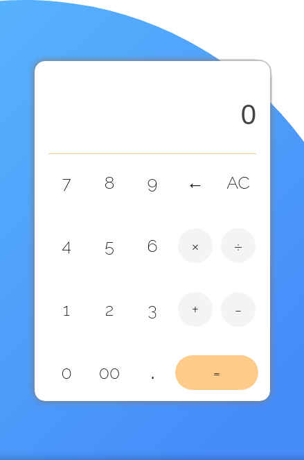

# simple-calculator

🎉 [Check it out here!](https://freshmre.github.io/simple-calculator/)

A simple calculator. This project is from [The Odin Project](https://www.theodinproject.com/paths/foundations/courses/foundations/lessons/calculator).
The calculator is bug-ridden unfortunately and its logic needs to be completely rewritten.

# To Do
🔴 Fix calculator logic (Cannot do negative numbers, cannot change operator after selecting one, consecutive operations cannot be done after pressing "=" 

🔴 Fix keyboard bug where keys (under the cursor?) will be focused and hitting enter will activate focused key instead of equal sign

🔴 UI/UX improvement (Click display to copy, add current operation to display, title, center background to appear in the same position across all resolutions, credits)
